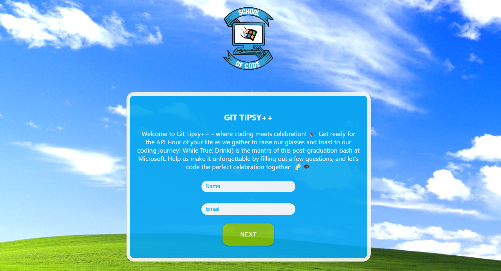
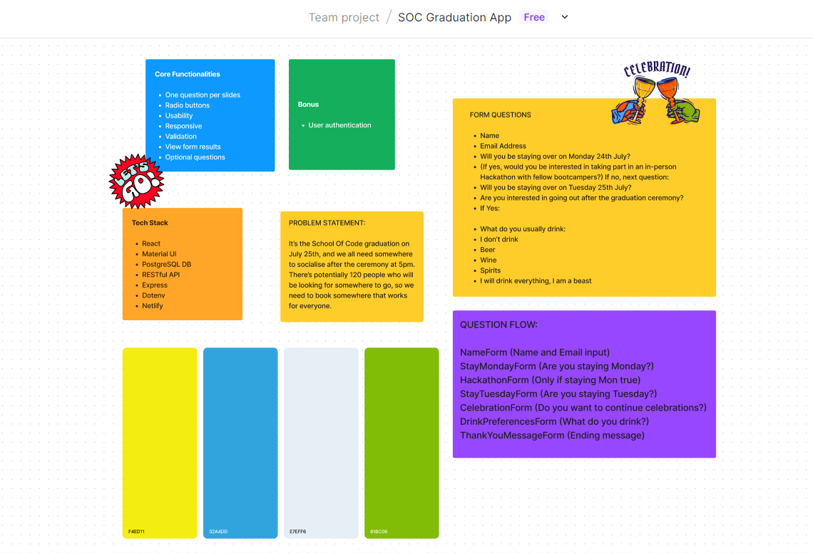
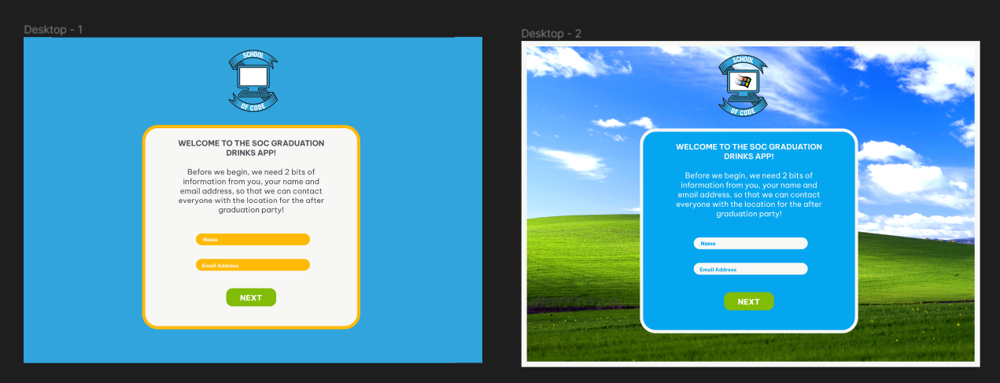

# Git Tipsy++ - The Coding Celebration App! 🎉🍻🎓

Welcome to Git Tipsy++ – where coding meets celebration! 🎉 Get ready for the API Hour of your life as we gather to raise our glasses and toast to our coding journey! While True: Drink() is the mantra of this post-graduation bash at Microsoft. Help us make it unforgettable by filling out a few questions, and let's code the perfect celebration together! 🍻🎓

## 🎉 About the App

Git Tipsy++ is not just your ordinary event planning app; it's a full-stack React application that we lovingly crafted from scratch, fueled by the enthusiasm and passion for coding! Together, [Your Name], [Sam Baldwin], and [Tom Webb] embarked on this exciting journey to bring our fellow bootcampers together for a memorable hackathon and celebration in Reading. 🚀

## 🎉 Let's Code the Perfect Celebration Together!

At Git Tipsy++, we believe in doing things the fun and challenging way! Sure, we could have easily used a Google Form for RSVPs, but where's the adventure in that? We've taken this opportunity to showcase our skills, collaboration, and love for coding by building this full-stack React app with a delightful touch of Material UI for some added flair! 🎨

From Figma Jam Boards for planning to a Trello board for tracking tasks, we've embraced Agile and Scrum to ensure we deliver a top-notch app for you! 💻

## 🚀 Check out the Tipsy++ App!

Click on the link and sound on!

https://soc-graduation-app.vercel.app/ 😎

## 🤝 Contributors & Acknowledgements

A big shoutout to the creators of Git Tipsy++:

- Victoria Platt ([GitHub Profile](https://github.com/your_username))
- Sam Baldwin ([GitHub Profile](https://github.com/sam_baldwin))
- Tom Webb ([GitHub Profile](https://github.com/tom_webb))

We also want to thank Hamza and the entire bootcamp community for their unwavering support and guidance throughout this project. You rock! 🤘

